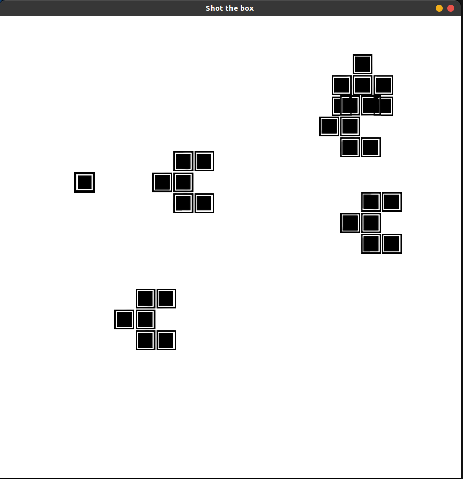

# Shoot the Box

## Overview

# Shoot the Box

"Shoot the Box" is a simple 2D shooting game created using the Pygame library in Python. In this game, you control a green box, representing your character, and your objective is to shoot the red boxes, which are the enemies.
## Features

- Player character with controllable movement.
- Shooting mechanism with bullets fired in the direction the player is facing.
- Enemy characters that move randomly around the screen.
- Enemy characters shoot bullets at the player.
- Collision detection between bullets and characters.
- Game over when the player is hit by an enemy bullet.

## How to Play

1. Use the arrow keys to move the player character (up, down, left, right).
2. Press the spacebar to shoot bullets in the direction the player is facing.
3. Eliminate enemy characters by shooting them with your bullets.
4. Avoid enemy bullets to stay alive.
5. The game is over when the player is hit by an enemy bullet.

